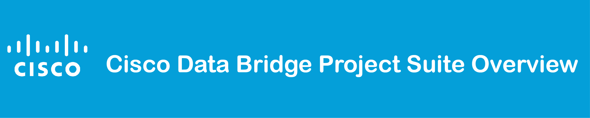
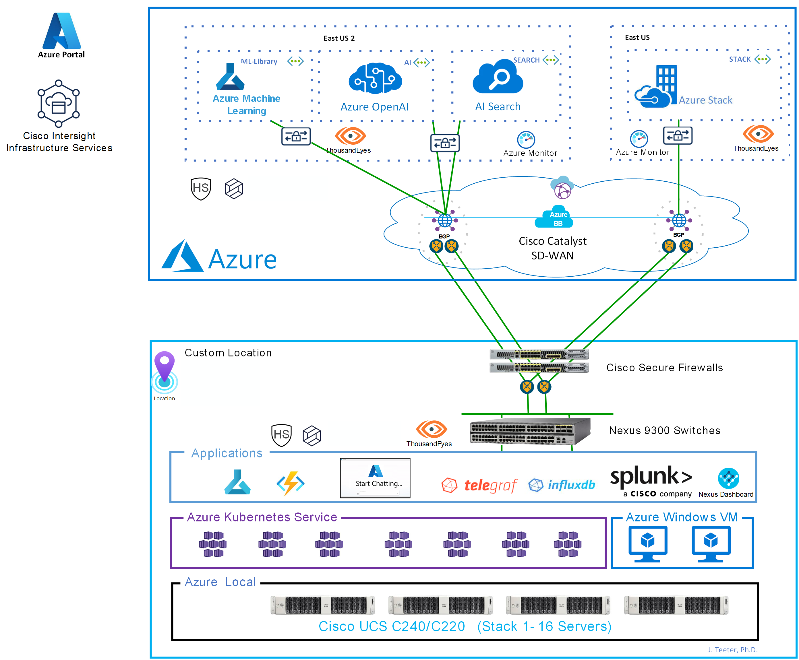
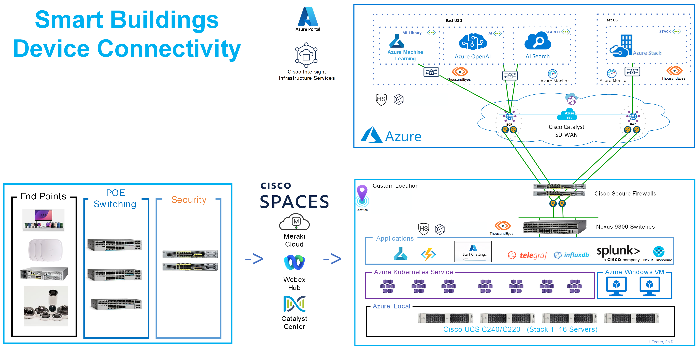
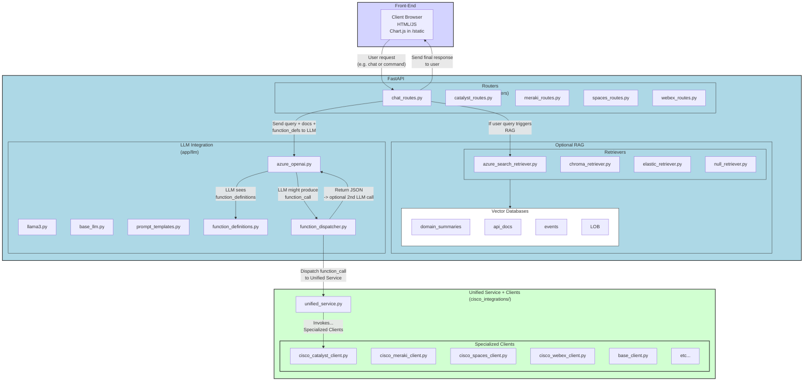

The Cisco Data Bridge Project Suite is a collection of four interrelated repositories designed to provide a complete, enterprise-grade AI/ML solution built on Cisco technologies and modern cloud tools. Whether you need a hybrid infrastructure for machine learning, a function-calling AI agent for Cisco platform integrations, domain-specific indexes for efficient retrieval, or a mobile app to bring it all together—these projects work seamlessly to deliver a secure and scalable environment.

1. **Hybrid AI/ML Solution on Azure Local with Cisco UCS**  
   - Sets up hybrid infrastructure so ML workloads can run securely either on-prem or in the cloud.

2. **Cisco Data Bridge AI Agent**  
   - Uses large language models (LLMs) and function calling to integrate with various Cisco platforms (Catalyst, Meraki, Spaces, Webex, etc.).

3. **Cisco Data Bridge Domain Index**  
   - Builds vector databases for domain summaries and Cisco API docs, optimizing retrieval for the AI agent.

4. **Cisco Data Bridge Connect**
   - A mobile (iOS) app for on-the-go access to the AI agent, domain indexes, and the underlying hybrid environment.

Together, these four projects form a robust ecosystem for developing and deploying AI-driven applications that tightly integrate with Cisco’s networking and collaboration platforms.

## How the Projects Work Together (Hybrid or On-Prem Only)
The four repositories in the Cisco Data Bridge Project Suite create a highly flexible architecture that can operate in hybrid clouds (mixing Azure and on-prem) or entirely within on-premises data centers. This modular design enables AI/ML workloads to run in whichever environment best suits security, performance, or compliance requirements—while still seamlessly integrating with the AI Agent, domain indexes, and mobile front-ends. Whether you need on-premises compute for strict data sovereignty or wish to burst into the cloud for large-scale ML training, the suite’s layered approach ensures that each project can be extended or replaced without disrupting the overall workflow.

## Key Use Cases

1. **Hidden Data Discovery and Insights**  
   - Use Cisco platforms and Azure AI/ML to uncover hidden data, consolidate it for advanced analytics, and enable smarter decisions. A great example is Smart Buildings for energy optimization and predictive maintenance.
   - By integrating data from on-prem sensors and cloud services, you gain holistic visibility into infrastructure performance, reducing costs and improving sustainability.

2. **Seamless Hybrid Operations**  
   - Manage workloads across cloud and on-premises via the Azure Portal to simplify operations. As an added bonus, you can even gain access to on-prem control platforms like Nexus Dashboard through the Azure Portal.
   - This unified approach streamlines IT management, letting administrators handle Cisco network resources and Azure-based AI services from a single pane of glass.

3. **Repatriation of Cloud Workloads**  
   - Bring workloads back on-premises to optimize costs, improve control, and maintain cloud-like efficiency.
   - If cloud expenses or data governance policies become challenging, organizations can seamlessly migrate AI/ML or other workloads back to their private data centers without sacrificing agility.

4. **Traditional Workloads Modernization**  
   - Run or migrate VMware VMs to Hyper-V, deploy scalable cloudlike VDI with on-prem low latency, and run SQL Server on-premises for high performance and low latency.  
   - Existing enterprise applications gain a modernization path, allowing them to tap into advanced AI/ML capabilities while staying compliant with on-prem latency and security requirements.

## Why this Architecture Matters

By establishing a resilient, scalable foundation, this architecture powers advanced AI/ML capabilities that address real-world challenges, safeguard your data, and propel your organization into the future.
- **Stay Competitive:** Leverage AI/ML solutions to innovate faster and remain relevant in today’s rapidly evolving landscape.  
- **Tackle Real Challenges:** Address critical priorities like sustainability, public safety, and operational efficiency with intelligent, data-driven insights.  
- **Secure Growth:** Deploy AI/ML in hybrid environments while protecting sensitive data and adhering to stringent security/compliance standards.  
- **Drive Transformation:** Streamline complex workflows, integrate advanced language models (e.g., ChatGPT) for enterprise use, and elevate business outcomes.  
- **Future-Proof Your Business:** Adopt an architecture designed for scalability and adaptability, ready for emerging AI/ML demands as your organization evolves.


---

## 1. Hybrid AI/ML Solution on Azure Local with Cisco UCS
**Repository:** [cisco-hybrid-ai-ml-azure-local](https://github.com/APO-SRE/cisco-hybrid-ai-ml-azure-local)  
**Purpose**  
- Provides reference architectures and deployment guidance for running AI/ML workloads in a **hybrid** model—combining Azure cloud services with on-premises Cisco UCS infrastructure.
- Utilizes Cisco's Azure Local on UCS and integrates with the rest of Cisco's products, services, and platforms (Cisco Spaces, Catalyst Center, Webex Control Hub, Meraki Cloud, etc.)
- Demonstrates how to connect, secure, manage, and scale AI and machine learning pipelines at the edge or in the data center with tools like Azure Kubernetes Service (AKS) and Azure Machine Learning.

**Relationship to Other Projects**  
- Serves as the *infrastructure backbone* for on-prem/hybrid compute resources.
- Offers robust connectivity and compute power that the AI Agent or retrieval workflows can utilize.

### Solution Diagram



**Figure: High-level overview of the Cisco AI-Driven Enterprise Data Architecture**

---

### Smart Buildings Device Connectivity Overview
The Smart Building environment is characterized by seamless connectivity between various devices (sensors, cameras, HVAC systems, etc.) and the hybrid data center. Cisco on-premises infrastructure integrates with Azure Cloud to ensure robust connectivity and security.



---

## 2. Cisco Data Bridge AI Agent
**Repository:** [cisco-data-bridge-ai-agent](https://github.com/APO-SRE/cisco-data-bridge-ai-agent)

**Overview**  
The Cisco Data Bridge AI Agent implements a function-calling AI system that uses large language models (LLMs) alongside FastAPI to dynamically route user requests to various Cisco platforms (e.g., Catalyst, Meraki, Spaces, Webex). Its design incorporates a decoupled front-end and back-end, an optional retrieval-augmented generation (RAG) layer for domain-specific context, and a unified Cisco service that standardizes interactions across multiple products.

**Key Features**
- **LLM & Retrieval Separation:**  
  The agent first determines if additional domain data is needed (via RAG) and then leverages the LLM for natural language understanding and function calling. This separation ensures that language processing is optimized without being overwhelmed by data retrieval concerns.

- **Function Dispatcher:**  
  Instead of hard-coding API calls, each integration is defined in a standardized schema (via `function_definitions.py`). When the LLM returns a structured function call, a dedicated dispatcher invokes the correct method in the unified Cisco service. This approach simplifies adding or modifying integrations.

- **Unified Cisco Service:**  
  All interactions with Cisco products are routed through a single service layer. This design guarantees consistent error handling, logging, and authentication while making it straightforward to swap or extend individual clients.

- **Modular, Scalable Architecture:**  
  The system is divided into distinct layers—front-end, FastAPI back-end (including routers, retrieval, and LLM integration), and Cisco integrations—allowing each component to be updated or scaled independently.

**High-Level Architecture Diagram**



**Integration with Other Projects**  
- **Hybrid Infrastructure:** Relies on the `cisco-hybrid-ai-ml-azure-local` repository to provide robust on-prem/hybrid compute resources.  
- **Domain Indexing:** Optionally leverages domain indexes from `cisco-data-bridge-domain-index` to optimize context retrieval for the LLM.  
- **Mobile Access:** Receives queries from the **Cisco Data Bridge Connect** app, enabling on-the-go access to the system.

---


## 3. Cisco Data Bridge Domain Index
**Repository:** [cisco-data-bridge-domain-index](https://github.com/APO-SRE/cisco-data-bridge-domain-index)  
**Purpose**  
- Builds specialized vector databases (e.g., Chroma, Azure Search, Elasticsearch) containing Cisco API docs and domain summaries.  
- Employs a **two-stage** approach:  
  1. A smaller, high-level domain summaries index to decide which Cisco product to use.  
  2. A larger, detailed API specs/docs index for deeper RAG queries.  
- Minimizes LLM overhead by returning only the most relevant context.

**Relationship to Other Projects**  
- Supplies the AI Agent with domain context, guiding which Cisco service to invoke and how.  
- Integrates with the hybrid environment (`cisco-hybrid-ai-ml-azure-local`) if vector data must be stored or processed on-prem.

---

## 4. Cisco Data Bridge Connect
**Repository:** [cisco-data-bridge-connect](https://github.com/APO-SRE/cisco-data-bridge-connect)  
**Purpose**  
- Delivers an **iOS (or mobile)** app granting real-time access to the Cisco Data Bridge ecosystem.  
- Offers a streamlined client interface to:  
  - Send queries to the AI Agent  
  - Utilize domain indexes (if RAG is enabled)  
  - Tap into hybrid or on-prem infrastructure for specialized ML tasks  
- Focuses on mobile security and enterprise compliance.

**Relationship to Other Projects**  
- Acts as the *mobile front-end* for the AI Agent, bridging requests to domain indexes and hybrid compute resources.  
- Empowers field teams and executives to run advanced AI/Cisco workflows from anywhere.

---

By combining hybrid infrastructure, a function-calling AI agent, specialized domain indexes, and a mobile access layer, the Cisco Data Bridge Project Suite supports your enterprise AI/ML needs—whether purely on-premises or as a hybrid solution with cloud services.
```

